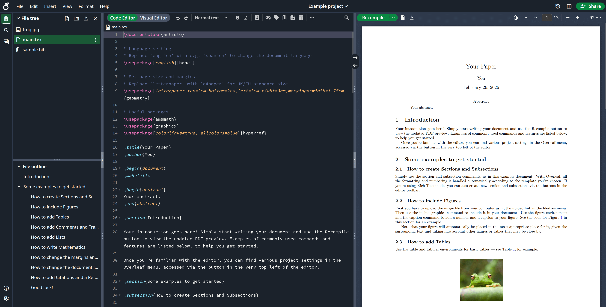

<h1 align="center">
   
  
</h1>

<h4 align="center">An open-source online real-time collaborative LaTeX editor.</h4>

  <a href="#key-features">Key Features</a> •
  <a href="https://github.com/overleaf/overleaf/wiki">Wiki</a> •
  <a href="https://www.sharelatex.com/i/university/onsite">Server Pro</a> •
  <a href="#contributing">Contributing</a> •
  <a href="https://www.overleaf.com/for/enterprises">Mailing List</a> •
  <a href="#authors">Authors</a> •
  <a href="#license">License</a>

## Key Features

[Overleaf](https://www.overleaf.com) is an open-source online real-time collaborative LaTeX editor. We run a hosted version at http://www.overleaf.com, but you can also run your own local version, and contribute to the development of Overleaf.

*[If you want help installing and maintaining Overleaf at your university or workplace, we offer an officially supported version called Overleaf Server Pro. It also comes with extra security and admin features. Click here to find out more!](https://www.overleaf.com/university/onsite.html)*

## Keeping up to date

Sign up to the [mailing list](https://mailchi.mp/overleaf.com/community-edition-and-server-pro) to get updates on Overleaf Releases and development

## Installation

We have detailed installation instructions in our wiki:

* [Overleaf Quick Start Guide](https://github.com/overleaf/overleaf/wiki/Quick-Start-Guide)

## Upgrading

If you are upgrading from a previous version of Overleaf, please see the [Release Notes section on the Wiki](https://github.com/overleaf/overleaf/wiki/Home) for all of the versions between your current version and the version you are upgrading to.

## Other repositories

This repository does not contain any code. It acts a wrapper and toolkit for managing the many different Overleaf  services. These each run as their own Node.js process and have their own GitHub repository. These are all downloaded and set up when you run `grunt install`

| Service | Description |
| ------- | ----------- |
| **[web](https://github.com/overleaf/web)** | The front facing web server that serves all the HTML pages, CSS and JavaScript to the client. Also contains a lot of logic around creating and editing projects, and account management. |
| **[document-updater](https://github.com/overleaf/document-updater)** | Processes updates that come in from the editor when users modify documents. Ensures that the updates are applied in the right order, and that only one operation is modifying the document at a time. Also caches the documents in redis for very fast but persistent modifications. |
| **[CLSI](https://github.com/overleaf/clsi)** | The Common LaTeX Service Interface (CLSI) which provides an API for compiling LaTeX documents. |
| **[docstore](https://github.com/overleaf/docstore)** | An API for performing CRUD (Create, Read, Update and Delete) operations on text files stored in Overleaf. |
| **[real-time](https://github.com/overleaf/real-time)** | The websocket process clients connect to. |
| **[filestore](https://github.com/overleaf/filestore)** | An API for performing CRUD (Create, Read, Update and Delete) operations on binary files (like images) stored in Overleaf. |
| **[track-changes](https://github.com/overleaf/track-changes)** | An API for compressing and storing the updates applied to a document, and then rendering a diff of the changes between any two time points. |
| **[chat](https://github.com/overleaf/chat)** | The backend API for storing and fetching chat messages. |
| **[spelling](https://github.com/overleaf/spelling)** | An API for running server-side spelling checking on Overleaf documents. |

## Overleaf Docker Image

This repo contains two dockerfiles, `Dockerfile-base`, which builds the
`sharelatex/sharelatex-base` image, and `Dockerfile` which builds the
`sharelatex/sharelatex` (or "community") image.

The Base image generally contains the basic dependencies like `wget` and
`aspell`, plus `texlive`. We split this out because it's a pretty heavy set of
dependencies, and it's nice to not have to rebuild all of that every time.

The `sharelatex/sharelatex` image extends the base image and adds the actual Overleaf code
and services.

Use `make build-base` and `make build-community` to build these images.

We use the [Phusion base-image](https://github.com/phusion/baseimage-docker)
(which is extended by our `base` image) to provide us with a VM-like container
in which to run the Overleaf services. Baseimage uses the `runit` service
manager to manage services, and we add our init-scripts from the `./runit`
folder.

## Contributing

Please see the [CONTRIBUTING](https://github.com/overleaf/overleaf/blob/master/CONTRIBUTING.md) file for information on contributing to the development of Overleaf. See [our wiki](https://github.com/overleaf/overleaf/wiki/Developer-Guidelines) for information on setting up a development environment and how to recompile and run Overleaf after modifications.

## Authors

[The Overleaf Team](https://www.overleaf.com/about)

## License

The code in this repository is released under the GNU AFFERO GENERAL PUBLIC LICENSE, version 3. A copy can be found in the `LICENSE` file.

Copyright (c) Overleaf, 2014-2019.
