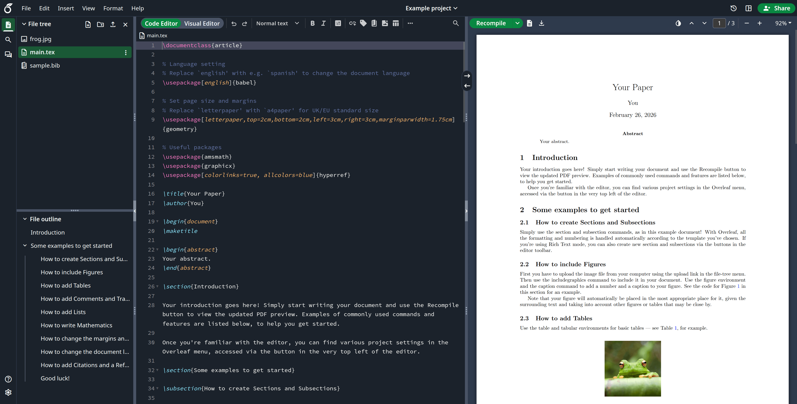

<h1 align="center">
کد LaTeX که گفتم، دقیقاً همین است. آن را کپی کنید و در Overleaf یا هر ویرایشگر LaTeX دیگر بگذارید تا خروجی PDF آماده شود:

```latex
\documentclass[12pt]{article}
\usepackage[utf8]{inputenc}
\usepackage{geometry}
\geometry{a4paper, margin=2cm}
\usepackage{setspace}
\usepackage{titlesec}
\usepackage{enumitem}

\titleformat{\section}[block]{\bfseries\Large}{}{0em}{}
\titlespacing*{\section}{0pt}{1em}{0.5em}

\begin{document}

\begin{center}
    \Large\textbf{اظهارنامه ثبت شرکت با مسئولیت محدود}
\end{center}
\vspace{1cm}

اینجانبان امضاءکنندگان ذیل متعهد می‌شویم که پس از ثبت این اظهارنامه، مطابق مواد قانونی و با رعایت مقررات، شرکت با مسئولیت محدودی را تشکیل داده و اداره کنیم.

\section*{۱. مشخصات شرکا}
\begin{center}
\begin{tabular}{|c|c|c|c|c|c|c|}
\hline
ردیف & نام و نام خانوادگی & شماره ملی & تاریخ تولد & تابعیت & محل اقامت & میزان سهم‌الشرکه (به ریال) \\
\hline
۱ & \texttt{[...]} & \texttt{[...]} & \texttt{[...]} & \texttt{[...]} & \texttt{[...]} & \texttt{[...]} \\
\hline
۲ & \texttt{[...]} & \texttt{[...]} & \texttt{[...]} & \texttt{[...]} & \texttt{[...]} & \texttt{[...]} \\
\hline
\end{tabular}
\end{center}

\section*{۲. نام شرکت}
\texttt{[نام کامل شرکت، مثلاً: شرکت [...] با مسئولیت محدود]}

\section*{۳. موضوع فعالیت شرکت}
\textbf{موضوع فعالیت:}
\begin{enumerate}[label=\textbf{\alph*)}]
    \item انجام امور فنی و مهندسی، مطالعات، نقشه‌برداری و آزمایش‌های لازم جهت تهیه طرح‌های مربوط به احداث نیروگاه‌های مختلف، ایجاد خطوط انتقال و شبکه توزیع نیروی برق و تأسیسات مرتبط با آن‌ها.
    \item تهیه طرح‌های لازم جهت توسعه، تکمیل و کنترل الکترونیک سیستم‌های موجود و بهبود بهره‌وری سیستم‌های در حال بهره‌برداری.
    \item همکاری در ایجاد مراکز آزمایشگاهی مرتبط با سیستم‌های برق و مشارکت در تهیه استانداردهای تأسیسات و ایمنی در زمینه تولید، انتقال و توزیع نیروی برق.
    \item ارائه خدمات نیروی انسانی (پس از اخذ مجوزهای قانونی).
    \item نصب و راه‌اندازی شبکه‌های کامپیوتری، کنترل، نصب و راه‌اندازی اتوماسیون و مانیتورینگ صنعتی.
    \item برنامه‌نویسی تابلوهای برق کنترل صنعتی پست‌ها، خطوط تولید، انتقال و توزیع برق.
    \item نظارت، مشاوره، طراحی، تأمین، نصب و نگهداری کلیه امور تأسیساتی و پیمانکاری، شامل تأسیسات حرارتی مرکزی و اجرای طرح‌های بهینه‌سازی مصرف انرژی.
    \item مشاوره، نظارت و اجرای امور عمرانی و ابنیه.
    \item مشاوره، نظارت و اجرای سیستم‌های اعلام و اطفای حریق، روشنایی و برق ساختمان‌های مسکونی، بیمارستان‌ها، مؤسسات آموزش عالی، دانشگاه‌ها و ادارات دولتی.
    \item خرید و فروش، واردات و صادرات کلیه کالاهای مجاز بازرگانی، ترخیص کالا از گمرک‌های داخلی و بین‌المللی، گشایش اعتبارات نزد بانک‌ها.
    \item اخذ و اعطای نمایندگی‌های مجاز بازرگانی، شرکت در نمایشگاه‌ها و غرفه‌آرایی.
    \item دریافت وام و تسهیلات از کلیه بانک‌ها و مؤسسات مالی و اعتباری.
    \item \textbf{ارائه خدمات مشاوره، نظارت و اجرا در زمینه ایمنی، بهداشت و محیط زیست (HSE)، خدمات مهندسی برق قدرت، نظارت و اجرای پروژه‌های ساختمانی و تأسیساتی در چارچوب قوانین نظام مهندسی و مقررات ملی ساختمان، و انجام تست، بازرسی فنی و تحویل تأسیسات برقی.}
\end{enumerate}
\textbf{تبصره:} کلیه فعالیت‌های فوق صرفاً با رعایت قوانین و مقررات جاری کشور و پس از اخذ مجوزهای لازم از مراجع ذی‌صلاح انجام خواهد پذیرفت.

\section*{۴. مرکز اصلی شرکت}
شهر \texttt{[...]}، استان \texttt{[...]}، خیابان \texttt{[...]}، کدپستی \texttt{[...]}

\section*{۵. شعب شرکت (در صورت وجود)}
در حال حاضر فاقد شعبه است. / یا: شرکت دارای \texttt{[...]} شعبه در شهرهای \texttt{[...]} می‌باشد.

\section*{۶. مدت شرکت}
از تاریخ ثبت به مدت \texttt{[...]} سال شمسی / نامحدود.

\section*{۷. سرمایه شرکت}
سرمایه شرکت مبلغ \texttt{[...]} ریال است که به \texttt{[...]} سهم‌الشرکه \texttt{[...]} ریالی تقسیم و تماماً نقداً پرداخت گردیده است.

\section*{۸. نام مدیر یا مدیران شرکت}
سمت مدیرعامل بر عهده آقای/خانم \texttt{[...]} به شماره ملی \texttt{[...]} می‌باشد که برای مدت \texttt{[...]} سال انتخاب شد و تا زمان انتخاب مجدد، مسئولیت اداره کلیه امور شرکت را در حدود موضوع فعالیت بر عهده دارد.

\section*{۹. روزنامه کثیرالانتشار}
روزنامه رسمی جمهوری اسلامی ایران و روزنامه کثیرالانتشار «\texttt{[...]}» به عنوان روزنامه‌های رسمی شرکت برای درج کلیه آگهی‌ها و دعوت‌نامه‌ها انتخاب می‌شود.

\vspace{1cm}
\section*{۱۰. امضای شرکا}
اینجانبان با علم به مفاد این اظهارنامه و با التزام به تعهدات آن، ذیل را امضا می‌نماییم.

\vspace{0.5cm}
\begin{center}
\begin{tabular}{cc}
نام و نام خانوادگی & امضا \\
\hline
\texttt{[...]} & \\
\texttt{[...]} & \\
\end{tabular}
\end{center}

\end{document}
```

جای موارد [...] را با اطلاعات واقعی خود پر کنید. موفق باشید.
<br>
  <a href="https://www.overleaf.com"></a>
</h1>

<h4 align="center">An open-source online real-time collaborative LaTeX editor.</h4>

<p align="center">
  <a href="https://github.com/overleaf/overleaf/wiki">Wiki</a> •
  <a href="https://www.overleaf.com/for/enterprises">Server Pro</a> •
  <a href="#contributing">Contributing</a> •
  <a href="https://mailchi.mp/overleaf.com/community-edition-and-server-pro">Mailing List</a> •
  <a href="#authors">Authors</a> •
  <a href="#license">License</a>
</p>


<p align="center">
  Figure 1: A screenshot of a project being edited in Overleaf Community Edition.
</p>

## Community Edition

[Overleaf](https://www.overleaf.com) is an open-source online real-time collaborative LaTeX editor. We run a hosted version at [www.overleaf.com](https://www.overleaf.com), but you can also run your own local version, and contribute to the development of Overleaf.

> [!CAUTION]
> Overleaf Community Edition is intended for use in environments where **all** users are trusted. Community Edition is **not** appropriate for scenarios where isolation of users is required due to Sandbox Compiles not being available. When not using Sandboxed Compiles, users have full read and write access to the `sharelatex` container resources (filesystem, network, environment variables) when running LaTeX compiles.

For more information on Sandbox Compiles check out our [documentation](https://docs.overleaf.com/on-premises/configuration/overleaf-toolkit/server-pro-only-configuration/sandboxed-compiles).

## Enterprise

If you want help installing and maintaining Overleaf in your lab or workplace, we offer an officially supported version called [Overleaf Server Pro](https://www.overleaf.com/for/enterprises). It also includes more features for security (SSO with LDAP or SAML), administration and collaboration (e.g. tracked changes). [Find out more!](https://www.overleaf.com/for/enterprises)

## Keeping up to date

Sign up to the [mailing list](https://mailchi.mp/overleaf.com/community-edition-and-server-pro) to get updates on Overleaf releases and development.

## Installation

We have detailed installation instructions in the [Overleaf Toolkit](https://github.com/overleaf/toolkit/).

## Upgrading

If you are upgrading from a previous version of Overleaf, please see the [Release Notes section on the Wiki](https://github.com/overleaf/overleaf/wiki#release-notes) for all of the versions between your current version and the version you are upgrading to.

## Overleaf Docker Image

This repo contains two dockerfiles, [`Dockerfile-base`](server-ce/Dockerfile-base), which builds the
`sharelatex/sharelatex-base` image, and [`Dockerfile`](server-ce/Dockerfile) which builds the
`sharelatex/sharelatex` (or "community") image.

The Base image generally contains the basic dependencies like `wget`, plus `texlive`.
We split this out because it's a pretty heavy set of
dependencies, and it's nice to not have to rebuild all of that every time.

The `sharelatex/sharelatex` image extends the base image and adds the actual Overleaf code
and services.

Use `make build-base` and `make build-community` from `server-ce/` to build these images.

We use the [Phusion base-image](https://github.com/phusion/baseimage-docker)
(which is extended by our `base` image) to provide us with a VM-like container
in which to run the Overleaf services. Baseimage uses the `runit` service
manager to manage services, and we add our init-scripts from the `server-ce/runit`
folder.

## Contributing

Please see the [CONTRIBUTING](CONTRIBUTING.md) file for information on contributing to the development of Overleaf.

## Authors

[The Overleaf Team](https://www.overleaf.com/about)

## License

The code in this repository is released under the GNU AFFERO GENERAL PUBLIC LICENSE, version 3. A copy can be found in the [`LICENSE`](LICENSE) file.

Copyright (c) Overleaf, 2014-2025.
