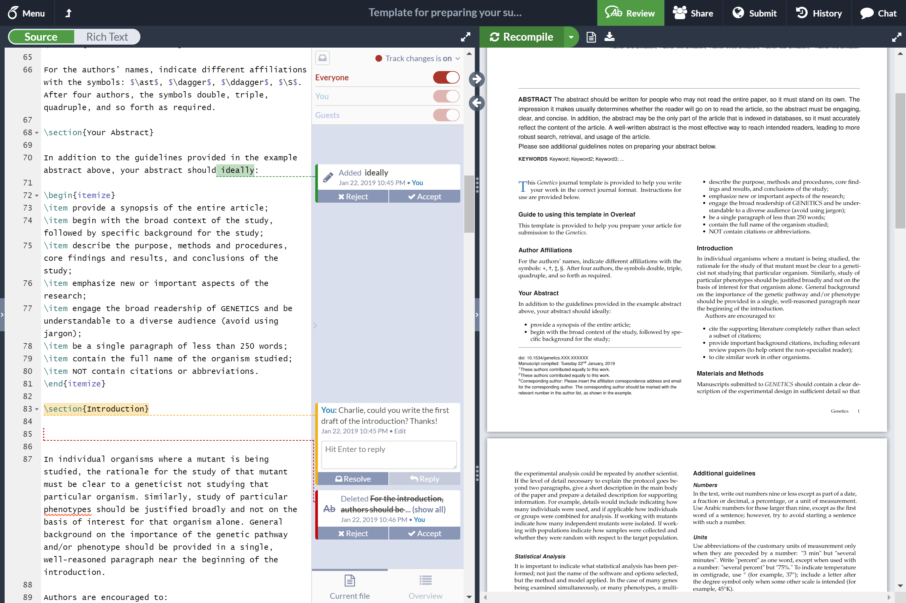

<h1 align="center">
  <br>
  Lemma
</h1>

<h4 align="center">AI-powered collaborative LaTeX editor. Cursor for LaTeX.</h4>

<p align="center">
  <a href="https://github.com/TryBayes/LemmaForLatex/wiki">Wiki</a> •
  <a href="#contributing">Contributing</a> •
  <a href="#authors">Authors</a> •
  <a href="#license">License</a>
</p>


<p align="center">
  Figure 1: A screenshot of a project being edited in Lemma.
</p>

## About Lemma

[Lemma](https://lemmaforlatex.com) is an AI-powered online real-time collaborative LaTeX editor. We run a hosted version at [lemmaforlatex.com](https://lemmaforlatex.com), and you can also run your own local version.

Lemma is a fork of [Overleaf Community Edition](https://github.com/overleaf/overleaf), enhanced with AI capabilities to supercharge your LaTeX workflow.

> [!CAUTION]
> Lemma Community Edition is intended for use in environments where **all** users are trusted. Community Edition is **not** appropriate for scenarios where isolation of users is required due to Sandbox Compiles not being available. When not using Sandboxed Compiles, users have full read and write access to the `sharelatex` container resources (filesystem, network, environment variables) when running LaTeX compiles.

## Installation

See the [AGENTS.md](AGENTS.md) file for detailed instructions on building and deploying Lemma.

### Quick Start

```bash
# Build the Docker image
cd server-ce
docker build --file Dockerfile --tag lemma/lemma:main ..

# Run with docker-compose
cd ..
docker-compose up -d
```

## Docker Image

This repo contains two dockerfiles, [`Dockerfile-base`](server-ce/Dockerfile-base), which builds the
base image, and [`Dockerfile`](server-ce/Dockerfile) which builds the main application image.

The Base image generally contains the basic dependencies like `wget`, plus `texlive`.
We split this out because it's a pretty heavy set of dependencies, and it's nice to not have to rebuild all of that every time.

The main image extends the base image and adds the actual Lemma code and services.

Use `make build-base` and `make build-community` from `server-ce/` to build these images.

We use the [Phusion base-image](https://github.com/phusion/baseimage-docker)
(which is extended by our `base` image) to provide us with a VM-like container
in which to run Lemma services. Baseimage uses the `runit` service
manager to manage services, and we add our init-scripts from the `server-ce/runit`
folder.

## Contributing

Please see the [CONTRIBUTING](CONTRIBUTING.md) file for information on contributing to the development of Lemma.

## Authors

Built by the Lemma Team, forked from [Overleaf](https://github.com/overleaf/overleaf).

## License

The code in this repository is released under the GNU AFFERO GENERAL PUBLIC LICENSE, version 3. A copy can be found in the [`LICENSE`](LICENSE) file.

Based on Overleaf, Copyright (c) Overleaf, 2014-2025.
